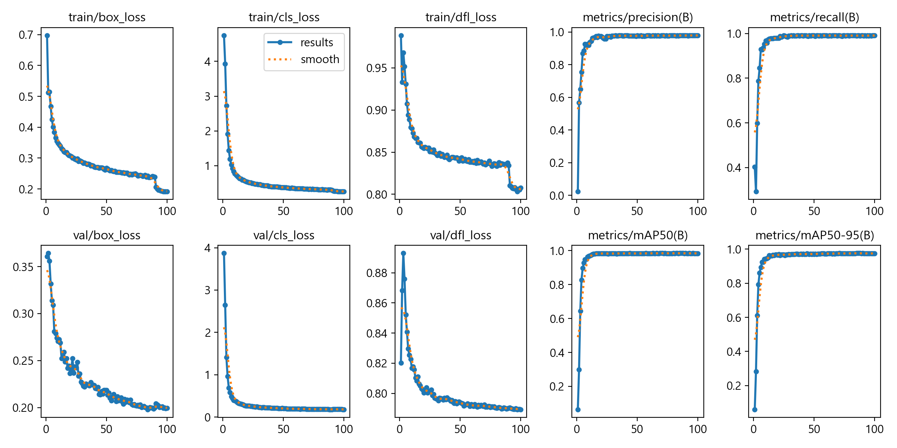

# HealthEat: 시각장애인을 위한 의약품 인식 및 음성 안내 서비스

AI 기반 헬스케어 프로젝트 > 사용자가 촬영한 알약 사진을 분석하여 정확한 의약품 명칭을 인식하고, 시각장애인을 위한 맞춤형 복약 정보 및 위치 가이드를 음성으로 제공합니다.

# 프로젝트 보고서 파일_pdf
- 22일 19시 제출 파일
- https://drive.google.com/file/d/1XkAUXP2GZG25Y6WCv-I_MN0PPczZBNDb/view?usp=share_link


## 프로젝트 개요 및 EDA

### 서비스 배경 및 타겟

비즈니스 모델: 기존 의약품 검색 서비스의 시각장애인 접근성 한계를 극복하고, 오복용 사고를 방지하는 실시간 안내 솔루션.

타겟 유저: 시력이 저하된 고령층 및 시각장애인 (Pill-Recognition MVP 모델 중심).

### 데이터 탐색 및 정제

Dataset: AIHub(알약 이미지) 및 공공데이터포털(의약품 제품 허가 정보) 활용.

데이터 정제:

- 고유 클래스(약제 코드) 분석 및 매칭 시스템 구축.
- 에러 클래스 결측치 처리 및 이미지-어노테이션 정합성 검사 자동화
- [Current] CV 기반 화질 개선: 저조도 및 흐릿한 환경에서의 인식률을 높이기 위해 CLAHE(Adaptive Histogram Equalization) 및 Sharpening 필터를 도입하여 객체 경계면 가시성 확보.
- [Roadmap] Diffusion 기반 데이터 증강: 부족한 학습 데이터 보강을 위해 Stable Diffusion + SAM을 활용한 고난도 배경 데이터 생성.

### 결과 그래프 예시



### 데모 앱 사용법

- 윈도우 유저 사용법
    - Download ZIP로 전체 개발 파일 다운로드 후 `app_augmentaition.bat`을 더블클릭하여 이미지 증강 앱 실행 가능
    - Download ZIP로 전체 개발 파일 다운로드 후 `app_speechT5.bat`을 더블클릭하여 객체 탐지 앱 실행 가능

- 파이썬에 익숙한 유저 사용법
    - git clone으로 리포지토리 복사
    - `uv venv --python 3.11` 명령어로 파이썬 가상환경 생성
    - `uv pip install -r requirements.txt` 명령어로 필요 라이브러리 설치
    - `uv run app_augmentation.py` 명령어로 이미지 증강 앱 실행 가능
    - `uv run app_speechT5.py` 명령어로 객체 탐지 앱 실행 가능

## 예측 모델 (Object Detection)

### 모델링 히스토리

- YOLO 시리즈: YOLOv8부터 최신 YOLOv11까지 성능 비교 및 도입.
  - S/N 모델 비교: 모바일 환경 실시간성을 고려한 경량화 모델 성능 최적화.
- Fast R-CNN 스터디: 1-Stage와 2-Stage 모델의 구조적 차이 분석 및 에러 케이스(오인식) 심층 분석.

### 성능 지표 및 최적화

- 평가 지표: Precision, Recall, F1-Score, mAP50 분석.
- 앙상블 시스템: WBF(Weighted Boxes Fusion) 알고리즘을 통한 다중 모델 추론 결과 최적화 (Score: 0.9893 달성).
- 결과 시각화: 테스트 이미지 및 증강 데이터셋에 대한 추론 성능 시각화 비교.

## 정보 전달 모델 (Interface)
- LLM (Information DB): 대규모 언어 모델을 활용하여 약품별 효능, 유의사항, 금기 약물 정보를 체계적인 DB로 구축.
- TTS (Voice Guide): 사용자의 카메라 위치를 기준으로 "약이 왼쪽 아래에 있습니다"와 같은 위치 가이드 및 음성 복약 가이드 제공.

## 프로젝트 구조 및 기술 스택
### Tech Stack
- Python, PyTorch, YOLOv8/v11, Stable Diffusion, SAM, WBF, TTS, GitHub, Notion

### Folder Structure
```
healtheat_vision/
├── artifacts/          # 프로젝트 결과물 (학습된 모델 가중치, 실험 리포트, 학습 로그 등)
├── configs/            # YOLO 모델 학습 및 데이터셋 구성을 위한 YAML 설정 파일 모음
├── data/               # 데이터셋 관리 (원본 데이터, 전처리 데이터, YOLO 포맷 데이터셋)
├── scripts/            # 환경 구축 및 외부 데이터(AIHub 등) 다운로드를 위한 셸 스크립트
├── diffusion/          # 데이터 증강용 디퓨전+SAM 스크립트
├── docs/               # 기타 문서 (AIhub 데이터셋, 공공 데이터 약제 코드 등)
├── src/                # 메인 소스 코드 모듈
│   ├── preprocessing/  # 원천 데이터 정제 (JSON 수정, 이미지 수집 및 무결성 검사)
│   ├── dataset/        # 학습용 데이터셋 빌드 (포맷 변환, 데이터 분할, 클래스 맵핑)
│   ├── train/          # YOLO 모델 학습 실행 및 중단된 학습 재개(Resume) 로직
│   ├── validation/     # 학습된 모델의 성능 평가 및 메트릭 분석
│   ├── pred/           # 테스트 데이터 추론 및 최종 제출 파일(CSV) 생성
│   ├── visualization/  # 학습 데이터 시각화 및 증강(Augmentation) 결과 확인 유틸리티
│   └── utils/          # 유틸리티 함수 모음
├── tests/              # 테스트 코드 모음
├── submissions/        # 최종 추론 결과물 (CSV)
└── README.md           # 프로젝트 설명
```

### 브랜치 전략

| Branch               | 용도                             |
| -------------------- | ------------------------------ |
| `main`               | 프로덕션 수준 코드 / **관리자만 merge 가능** |
| `dev` | 팀 개발용 통합 브랜치                   |
| `feature/개인 브랜치`          | 개인별 학습, 개발, 실험 브랜치                 |


### Git 규칙

- 직접 main 브랜치에 push 금지
- 관리자 승인이 있어야 merge 가능

### 커밋 메시지 컨벤션

- feat: 기능 추가
- fix: 버그 수정
- docs: 문서 작성/수정
- style: 코드 스타일 변경
- refactor: 기능 변화 없는 코드 개선
- test: 테스트 코드 추가/수정
- chore: 빌드 프로세스 또는 auxiliary tools의 변경

## 스테이블 디퓨전 이미지 증강 세부 설명

[README.md](/diffusion/README.md)

## 결론

### 시연 영상 모음

- [YOLO + Qwen + SpeechT5 TTS 적용 객체 탐지 앱 시연 영상](https://drive.google.com/file/d/1nNx2LavNJ7TT9Ar1Qc2MVWKvdJSoZ0qM/view?usp=sharing)
- [YOLO + Qwen + VITS TTS 적용 객체 탐지 앱 시연 영상](https://drive.google.com/file/d/1ZmWTazO8r-AhPVrtuM4rIPqxrRPnqClb/view?usp=sharing)
- [Stable Diffusion + SAM 이미지 증강 앱 시연 영상](https://drive.google.com/file/d/1dJE3ClaXjYRL5pZGG99KwnFMwH07jgWS/view?usp=sharing)

### 회고

- 한계점: 실제 사용 환경(저조도, 흔들림)과 학습 데이터 간의 괴리를 Diffusion 증강으로 일부 극복했으나, 실 기기 배포 시의 최적화 과제 남음.
- 인사이트: 도메인 지식(의약품 코드)에 기반한 데이터 정제의 중요성과 대규모 데이터 파이프라인 자동화 경험 획득.
